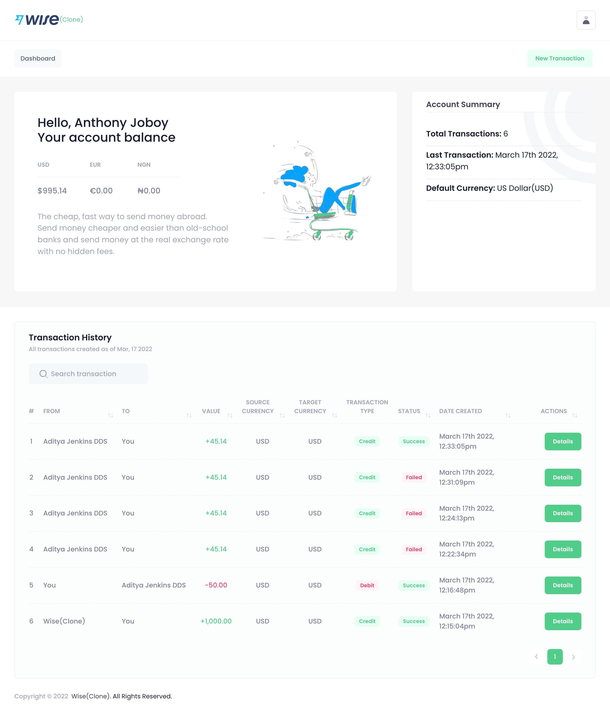
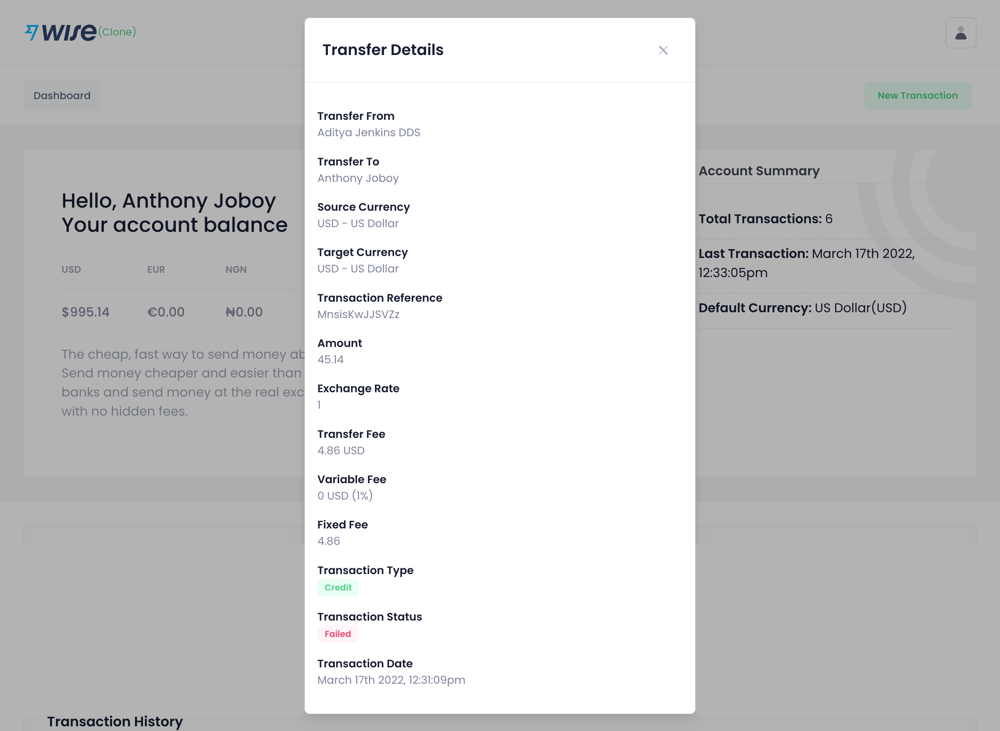

#  Wise(Clone) 

This project was created based on Trial 1 Mission requirements for the Simba Coding Project.

## About Wise(Clone)

This is a clone of [Wise Web Application](https://www.wise.com) (The cheap, fast way to send money abroad). This web application features the following:

1. A login page.
2. A registration page.
3. A dashboard page, where transactions will be listed.
4. A transaction page. 
5. API integration to get current exchange rate from [Free Currency Converter API](https://www.currencyconverterapi.com/). 
6. A method to record failed transactions.
7. A button to refund dollar account.

## Wise(Clone) Application Development Procedures

1. CD into the application root directory with your command prompt/terminal/git bash.

2. Run `cp .env.example .env`.

3. Inside `.env` file, setup database, mail and other configurations.

4. Run `composer install`.

5. Run `php artisan key:generate` command.

6. Run `php artisan migrate:fresh --seed` command.

7. Run `php artisan serve` command.

## Login credentials
URL: [Wise(Clone) Web Application](https://wiseclone.edgemep.com.ng/)

Email: `user@wiseclone.com`

Password: `password`

## Project Screenshots

